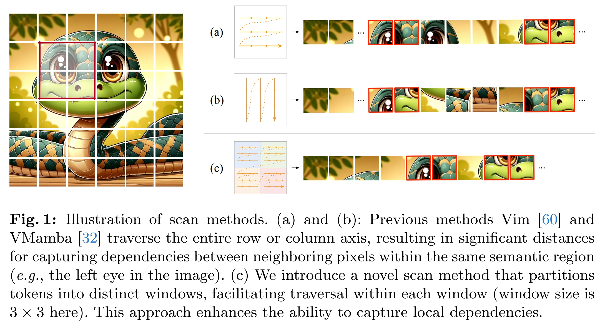
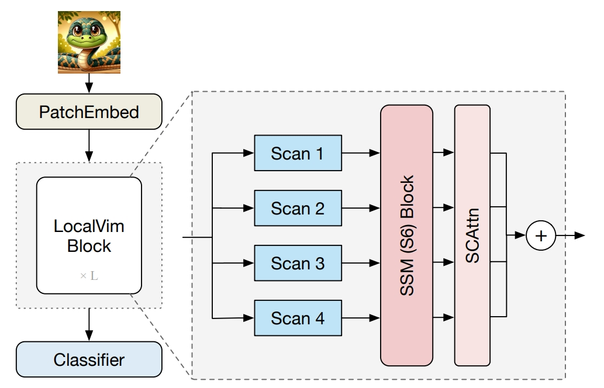

<div align="center">
<h1>LocalMamba</h1>
<h3>LocalMamba: Visual State Space Model with Windowed Selective Scan</h3>

[Tao Huang](https://taohuang.info), Xiaohuan Pei, [Shan You](https://shanyou92.github.io), [Fei Wang](https://scholar.google.com.hk/citations?user=ljt16JkAAAAJ), Chen Qian, [Chang Xu](http://changxu.xyz/)

ArXiv Preprint ([arXiv 2403.09338](https://arxiv.org/abs/2403.09338))

</div>

* [**Updates**](#updates)  
* [**Overview**](#overview)  
* [**Main results**](#main-results)
* [**Getting started**](#getting-started)  
* [**Image Classification**](#image-classification)  


## Updates

* 19 Mar: We released the classification code of `LocalVim`. The checkpoint and training log of `LocalVim-T` are uploaded.

* 15 Mar: We are working hard in releasing the code, it will be public in several days.


## Overview
<details>

### Abstract

Recent advancements in state space models, notably Mamba, have demonstrated significant progress in modeling long sequences for tasks like language understanding. Yet, their application in vision tasks has not markedly surpassed the performance of traditional Convolutional Neural Networks (CNNs) and Vision Transformers (ViTs). This paper posits that the key to enhancing Vision Mamba (ViM) lies in optimizing scan directions for sequence modeling. Traditional ViM approaches, which flatten spatial tokens, overlook the preservation of local 2D dependencies, thereby elongating the distance between adjacent tokens. We introduce a novel local scanning strategy that divides images into distinct windows, effectively capturing local dependencies while maintaining a global perspective. Additionally, acknowledging the varying preferences for scan patterns across different network layers, we propose a dynamic method to independently search for the optimal scan choices for each layer, substantially improving performance. Extensive experiments across both plain and hierarchical models underscore our approach's superiority in effectively capturing image representations. For example, our model significantly outperforms Vim-Ti by 3.1% on ImageNet with the same 1.5G FLOPs.


### Local Scan
<p align='center'>

</p>

### Architecture of LocalVim

<p align='center'>

</p>

</details>

## Main Results

### ImageNet classification

|Model|Dataset|Resolution|ACC@1|#Params|FLOPs|ckpts/logs|
|:--:|:--:|:--:|:--:|:--:|:--:|:--:|
|Vim-Ti|ImageNet-1K|224x224|73.1|7M|1.5G|-|
|LocalVim-T|ImageNet-1K|224x224|76.2|8M|1.5G|[ckpt](https://github.com/hunto/LocalMamba/releases/download/v1.0.0/local_vim_tiny.ckpt)/[log](https://github.com/hunto/LocalMamba/releases/download/v1.0.0/log_local_vim_tiny.txt)|

## Getting Started

### Installation

#### 1. Clone the LocalMamba repository:

```shell
git clone https://github.com/hunto/LocalMamba.git
```

#### 2. Environment setup:

We tested our code on `torch==1.13.1` and `torch==2.0.2`.

_**Install Mamba kernels:**_
```shell
cd causual-conv1d && pip install .
cd ..
cd mamba-1p1p1 && pip install .
```


Other dependencies:
```shell
timm==0.9.12
```


## Image Classification

### Dataset

We use ImageNet-1K dataset for training and validation. It is recommended to put the dataset files into `./data` folder, then the directory structures should be like:
```
classification
├── lib
├── tools
├── configs
├── data
│   ├── imagenet
│   │   ├── meta
│   │   ├── train
│   │   ├── val
│   ├── cifar
│   │   ├── cifar-10-batches-py
│   │   ├── cifar-100-python
```

### Evaluation
```shell
sh tools/dist_run.sh tools/test.py ${NUM_GPUS} configs/strategies/local_vmamba/config.yaml timm_local_vim_tiny --drop-path-rate 0.1 --experiment lightvit_tiny_test --resume ${ckpt_file_path}
```

### Train models with 8 GPUs
* LocalVim-T  
    ```shell
    sh tools/dist_train.sh 8 configs/strategies/local_mamba/config.yaml timm_local_vim_tiny -b 128 --drop-path-rate 0.1 --experiment local_vim_tiny
    ```

_**Other training options**_:  
* `--amp`: enable torch Automatic Mixed Precision (AMP) training. It can speedup the training on large models. We open it on LocalVMamba models.  
* `--clip-grad-norm`: enable gradient clipping.  
* `--clip-grad-max-norm 1`: gradient clipping value.  
* `--model-ema`: enable model exponential moving average. It can improve the accuracy on large model.
* `--model-ema-decay 0.9999`: decay rate of model EMA.  

### Search scan directions

#### 1. Train the search space (supernet) `local_vim_tiny_search`:
```shell
sh tools/dist_train.sh 8 configs/strategies/local_mamba/config.yaml timm_local_vim_tiny_search -b 128 --drop-path-rate 0.1 --experiment local_vim_tiny --epochs 100
```

After training, run `tools/vis_search_prob.py` to get the searched directions.

## License  
This project is released under the [Apache 2.0 license](LICENSE).

## Acknowledements

This project is based on Mamba ([paper](https://arxiv.org/abs/2312.00752), [code](https://github.com/state-spaces/mamba)), Vim ([paper](https://arxiv.org/abs/2401.09417), [code](https://github.com/hustvl/Vim)), VMamba ([paper](https://arxiv.org/abs/2401.10166), [code](https://github.com/MzeroMiko/VMamba)), thanks for the excellent works.

If our paper helps your research, please consider citing us:
```
@article{huang2024localmamba,
  title={LocalMamba: Visual State Space Model with Windowed Selective Scan},
  author={Huang, Tao and Pei, Xiaohuan and You, Shan and Wang, Fei and Qian, Chen and Xu, Chang},
  journal={arXiv preprint arXiv:2403.09338},
  year={2024}
}
```